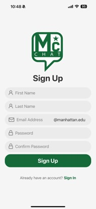

# MC-Chat

MC-Chat is a messaging platform designed for Manhattan College, offering secure and convenient communication for students and faculty members. Built with React Native and leveraging Firebase for real-time data synchronization and authentication, MC-Chat offers a multitude of features, bringing a full package chatting application for all users across iOS and Android.

## Key Features

### Secure Registration and Authentication
- **Sign up exclusively with Manhattan College email addresses.** 
- **Access the system with your registered email and password.**
- **Utilize the 'Forgot My Password' feature for secure password resets.**
   
### Comprehensive Profile Management
- **Add personal details such as Major, Graduation Year, Department, and Title.** 
- **An optional profanity filter for professional standards.** 

### Versatile Messaging Capabilities
- **Exchange text and voice messages or engage in private voice and video chats.** 
- **Create chat rooms with robust permissions and appoint moderators or co-administrators.** 
- **Share files, images, voice messages, and emojis across formats.** 

### User Directory and Social Features
- **Browse a list of verified users, with options to block or friend for personalized interaction.** 
- **Manage incoming friend requests, fostering a connected community.**
   
### Advanced Content Moderation
- **Block users and report inappropriate content to maintain a safe environment.** 
- **Content flagged by multiple users is obscured pending administrative review.** 

### AI-Assisted Messaging
- **With the click of a button you can have AI-generated responses custom tailored to your current chat/conversation.** 

### Real-Time Notifications
- **Receive instant notifications for messages, friend requests, and other alerts.** 

## Screenshots

### Registration and Login

<div style="display: flex; flex-wrap: wrap;">
  <div style="flex: 1; margin-right: 10px;">
    <h4>Registration</h4>
    
  </div>
  <div style="flex: 1; margin-right: 10px;">
    <h4>Login</h4>
    
  </div>
  <div style="flex: 1;">
    <h4>Forgot Password</h4>
    
  </div>
</div>

### Profile Setup

<div style="display: flex; flex-wrap: wrap;">
  <div style="flex: 1;">
    <h4>Profile Settings</h4>
    
  </div>
</div>

### Chat Functionality

<div style="display: flex; flex-wrap: wrap;">
  <div style="flex: 1; margin-right: 10px;">
    <h4>Chats View</h4>
    
  </div>
  <div style="flex: 1;">
    <h4>Chat Menu</h4>
    
  </div>
</div>

### Friends and Requests

<div style="display: flex; flex-wrap: wrap;">
  <div style="flex: 1;">
    <h4>Friend Requests</h4>
    
  </div>
</div>

### Directory and Contacts

<div style="display: flex; flex-wrap: wrap;">
  <div style="flex: 1;">
    <h4>Directory View</h4>
    
  </div>
</div>

### Group Chats and Rooms

<div style="display: flex; flex-wrap: wrap;">
  <div style="flex: 1; margin-right: 10px;">
    <h4>Rooms Creation</h4>
    
  </div>
  <div style="flex: 1; margin-right: 10px;">
    <h4>Rooms Interface</h4>
    
  </div>
  <div style="flex: 1;">
    <h4>Rooms Menu</h4>
    
  </div>
</div>

<div style="display: flex; flex-wrap: wrap;">
  <div style="flex: 1;">
    <h4>Rooms View</h4>
    
  </div>
</div>

### Application Settings

<div style="display: flex; flex-wrap: wrap;">
  <div style="flex: 1;">
    <h4>App Settings View</h4>
    
  </div>
</div>


## Getting Started

### Prerequisites

Before you begin, ensure you have the following installed:
- Node.js
- npm or Yarn
- Expo CLI
- Expo Go App on your mobile device/emulator

### Installation

1. Clone the repository:
```git clone https://github.com/hsallaku/mc-chat```

2. Navigate to the project directory:
```cd mc-chat```

3. Install dependencies:
```npm install``` or if you're using Yarn ```yarn install```

### Running the App

To start the development server and run the app:
```npx expo start```

You can then open the app in your device by using the Expo app which will require you to either enter the generated URL or you could simply scan the QR code generated in the terminal. Alternatively, if not your personal device you could use an emulator with the Expo app installed to do the same thing.

## Project Structure

- `/assets`: Contains image assets and stylesheets.
- `/components`: Reusable components used throughout the app.
- `/logic`: Business logic and context providers.
- `/navigators`: Navigation setup for the app.
- `/screens`: Individual screens of the app.

## Contributors

Special thanks to the amazing people who have collaborated with me on this project:

- Gary LaPicola
- Thomas Scardino
- Louie Celliberti

Their contributions have been invaluable to the development and success of MC-Chat.

## License

This project is licensed under the MIT License.
